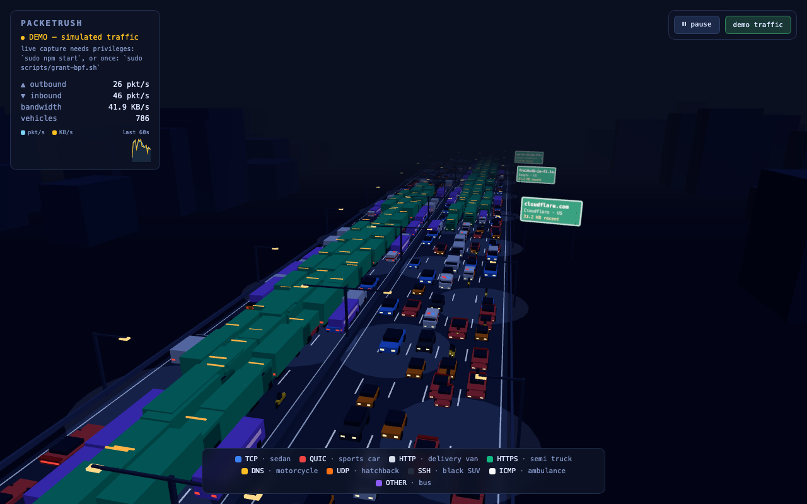
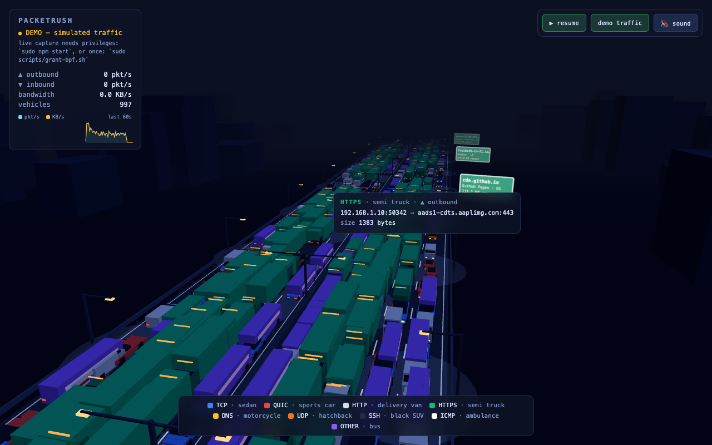
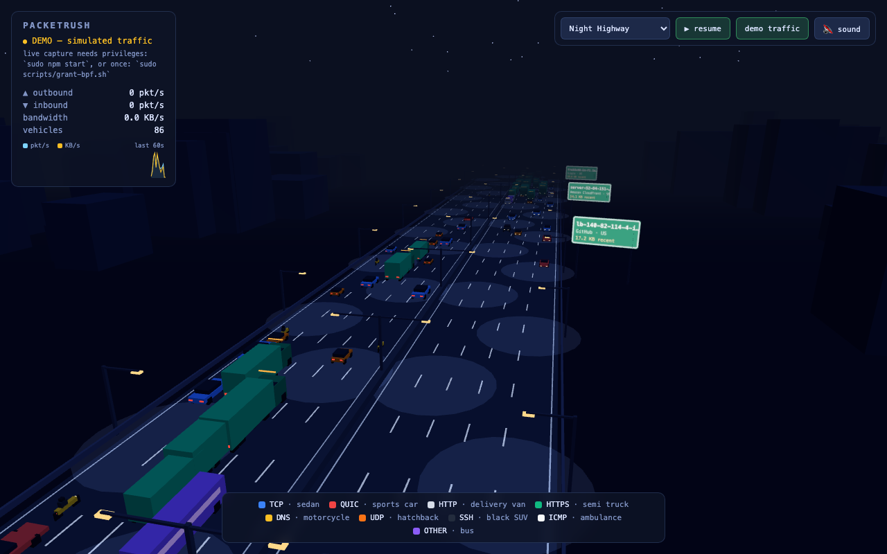
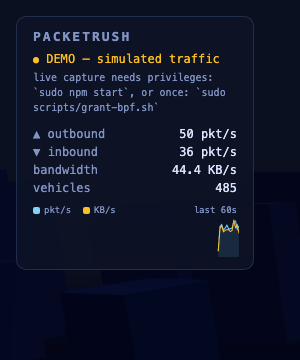

# PacketRush — Full Documentation

PacketRush turns your machine's live network traffic into a 3D night-highway
visualization: every captured packet becomes a vehicle whose **type** encodes
the protocol, whose **size** encodes the payload length, and whose **direction
of travel** encodes inbound vs. outbound. A connection's packets group into a
**convoy** so a download visibly reads as a line of trucks.

It is intentionally tiny: a single Node server (one runtime dependency, `ws`)
plus a Three.js front end. No build step, no framework, no bundler, no external
art assets — every vehicle and scene is procedural geometry generated at
runtime.

- [1. Quick start](#1-quick-start)
- [2. Architecture](#2-architecture)
- [3. The capture pipeline](#3-the-capture-pipeline)
- [4. Protocol → vehicle mapping](#4-protocol--vehicle-mapping)
- [5. Flow convoys](#5-flow-convoys)
- [6. Reverse DNS & GeoIP exit signs](#6-reverse-dns--geoip-exit-signs)
- [7. The rendering engine](#7-the-rendering-engine)
- [8. Themes & fleets](#8-themes--fleets)
- [9. HUD & interactions](#9-hud--interactions)
- [10. Configuration](#10-configuration)
- [11. Capture privileges](#11-capture-privileges)
- [12. Testing](#12-testing)
- [13. Project structure](#13-project-structure)
- [14. Extending PacketRush](#14-extending-packetrush)
- [15. Performance & browser support](#15-performance--browser-support)
- [16. License](#16-license)

---

## 1. Quick start

```bash
npm install
sudo npm start        # sudo needed for live packet capture on macOS
# open http://localhost:8090
```

Without privileges the server still runs; tcpdump cannot open the capture
device, so the browser automatically falls back to **simulated demo traffic**.
You can force demo mode with `/?demo` or the **demo traffic** button.

```bash
npm test              # 31 unit tests
npm run check         # syntax-check server + ES modules
```

---

## 2. Architecture

```
┌─────────────┐   tcpdump -l   ┌──────────────┐   WebSocket    ┌──────────────┐
│   kernel    │ ─────────────▶ │  server.js   │ ─────────────▶ │ public/      │
│  BPF / NIC  │   stdout lines │  (Node + ws) │  JSON batches  │ main.js      │
└─────────────┘                └──────────────┘   every 100ms  │ (Three.js)   │
                                      │                         └──────────────┘
                          parse → classify → direction                │
                          flow-tag → reverse-DNS                       │
                                                          spawn vehicles, render,
                                                          pick, filter, theme/fleet
```

**Server (`server.js`, ~330 lines).** Spawns `tcpdump`, parses each line into a
packet record, classifies the protocol, decides direction, tags it with a flow
id, kicks off a cached reverse-DNS lookup, and broadcasts batched packets to all
connected browsers over WebSocket. Also serves the static front end over HTTP.

**Client (`public/`).** Pure ES modules, no bundler:

| File | Responsibility |
|------|----------------|
| `main.js` | scene/render loop, vehicle lifecycle, picking, filters, HUD, sparkline, audio, theme/fleet switching |
| `vehicles.js` | the default **car** fleet (9 protocol-mapped models) + `InstancedMesh` builder |
| `fleets.js` | 11 additional fleets (boats, spacecraft, fish, aircraft, trains, animals, dinosaurs, …) sharing the same 9 slots |
| `themes.js` | 26 scene environments (lighting, fog, sky, props) with shared procedural builders |
| `geoip.json` | offline prefix → org/country table for exit signs |
| `index.html` | DOM scaffold, HUD, controls, Three.js import map |

The single source of coupling between server and client is the **packet record**:

```jsonc
{
  "proto": "https",   // protocol family (see §4)
  "len":   1448,       // payload length in bytes → vehicle scale
  "dir":   "in",       // "in" (inbound) | "out" (outbound) → carriageway
  "src":   "142.250.74.196",
  "dst":   "192.168.1.10",
  "sport": 443,
  "dport": 52344,
  "flow":  37           // 5-tuple flow id (see §5)
}
```

---

## 3. The capture pipeline

PacketRush runs `tcpdump -i <iface> -n -q -l -t -U`:

| flag | effect |
|------|--------|
| `-n` | no name resolution (PacketRush does its own, cached — see §6) |
| `-q` | quiet/brief output, one concise line per packet |
| `-l` | line-buffered stdout so packets arrive immediately |
| `-t` | no timestamps (we don't need them) |
| `-U` | unbuffered packet-by-packet output |

### Parsing

`parseLine()` matches lines like:

```
IP  142.250.74.196.443 > 192.168.1.5.52344: tcp 1448
IP  8.8.8.8.53 > 192.168.1.5.55321: UDP, length 120
IP  192.168.1.1 > 192.168.1.5: ICMP echo reply, length 64
IP6 fe80::1.5353 > ff02::fb.5353: UDP, length 100
ARP, Request who-has 192.168.1.1 ...
```

`splitHostPort()` separates host from port for both IPv4 (4 dots = `addr.port`)
and IPv6 (port present only when a dot follows the last colon, e.g.
`ff02::fb.5353`). Malformed and non-IP lines return `null` and are dropped.

### Classification

`classify(proto, srcPort, dstPort)` maps the transport + ports to a **protocol
family** (the thing that picks a vehicle):

| family | rule |
|--------|------|
| `https` | TCP with port 443 |
| `http`  | TCP with port 80 |
| `ssh`   | TCP with port 22 |
| `dns`   | TCP/UDP with port 53, or UDP 5353 (mDNS) |
| `quic`  | UDP with port 443 |
| `tcp`   | any other TCP |
| `udp`   | any other UDP |
| `icmp`  | ICMP/ICMP6 |
| `other` | ARP and everything else |

### Direction

The server snapshots all local interface addresses at start
(`os.networkInterfaces()`). If a packet's **source** is a local address it is
**outbound** (`dir: "out"`), otherwise **inbound** (`dir: "in"`).

### Batching

Packets accumulate in a buffer and are broadcast every **100 ms**
(`BATCH_INTERVAL_MS`), capped at **80 packets per batch**
(`MAX_PACKETS_PER_BATCH`); overflow is counted and reported as `dropped` so the
UI can show pressure without unbounded memory growth. This bounds the
visualization latency to roughly batch interval + one or two render frames
(≈150 ms end-to-end).

---

## 4. Protocol → vehicle mapping

Every fleet shares the **same nine protocol slots**, so the legend, filters,
tooltips, and convoys behave identically no matter which scene you're in. In the
default **car** fleet:

| Protocol family | Slot key | Default vehicle | Colour |
|-----------------|----------|-----------------|--------|
| HTTPS (TCP 443) | `truck` | semi truck (green container) | 🟢 `#10b981` |
| QUIC (UDP 443) | `sports` | red sports car | 🔴 `#ef4444` |
| HTTP (TCP 80) | `van` | pale delivery van | ⚪ `#d7dde9` |
| generic TCP | `car` | blue sedan | 🔵 `#3b82f6` |
| DNS (53 / 5353) | `moto` | amber motorcycle | 🟡 `#fbbf24` |
| generic UDP | `buggy` | orange hatchback | 🟠 `#f97316` |
| SSH (TCP 22) | `suv` | black SUV | ⬛ `#232c3d` |
| ICMP (ping) | `ambulance` | ambulance + light bar | ⬜ `#f8fafc` |
| everything else | `bus` | purple bus | 🟣 `#8b5cf6` |

**Packet size → vehicle scale:** `scale = 0.8 + min(len / 1500, 1) × 0.45`, so a
1500-byte full MTU packet is ~55 % larger than a tiny 60-byte ACK.

The slot colours are the legend identity colours and are kept consistent across
all fleets (a whale and a semi truck are both the green HTTPS slot).

---

## 5. Flow convoys

Random chatter and a sustained download look very different on the wire, and
PacketRush makes that visible. The server keeps a **flow table** keyed by a
normalized 5-tuple (protocol + sorted endpoints), so both directions of a
connection share one small integer `flow` id:

- The table is a recency-ordered `Map`; touched flows are re-inserted so the
  oldest entry is always first.
- Idle flows are **evicted after 30 s**; a periodic sweep stops at the first
  fresh entry (the rest are newer).
- The table is capped at **4096 flows**; on overflow the oldest is dropped.

On the client, each flow gets a **stable lane and speed**, and convoy members
are **spaced a fixed gap apart** by delaying spawns until the previous member is
far enough ahead. The result: a download becomes an orderly line of identical
vehicles in one lane, while background chatter scatters across all lanes.

---

## 6. Reverse DNS & GeoIP exit signs

**Reverse DNS.** For each remote endpoint the server performs a cached
`dns.reverse()` lookup — 2048-entry cache, 10-minute TTL, negative caching, at
most 4 lookups in flight, and a 256-entry shed queue under bursts. Resolved
names stream to the browser as `{type:"names", names:{ip:hostname}}` and are
replayed to new connections, so the inspect tooltip shows
`server-52-84-151-9.fra56.r.cloudfront.net:443` instead of a bare IP.

**GeoIP exit signs.** `public/geoip.json` is a curated **offline** prefix table
(~58 IPv4 CIDRs + IPv6 prefixes) mapping address ranges to org + country
(Google, Cloudflare, Fastly, Akamai, AWS, Apple, Microsoft, GitHub, Meta,
Netflix, Hetzner, OVH, Telegram, plus LAN/multicast ranges). The lookup uses
longest-prefix matching, runs entirely client-side, and the top destinations by
recent byte volume get green roadside **exit signs** showing hostname, org,
country, and recent KB. Because the table is bundled, signs work offline and in
demo mode.



---

## 7. The rendering engine

**Instanced vehicles.** Each vehicle type is a single `InstancedMesh` so the
whole fleet draws in two draw calls per type (body + an unlit "glow" mesh for
headlights/taillights). This is what lets hundreds — up to **1000**
(`MAX_VEHICLES`) — of vehicles render smoothly. Bodies use a vertex-coloured
Lambert material; glow geometry uses an unlit Basic material so lights stay
bright at night.

**Geometry.** Vehicles are built by merging a list of coloured boxes
(`[cx, cy, cz, w, h, l, color]`) into one `BufferGeometry` with per-vertex
colours. No GLTF, no textures (except the canvas-drawn billboard/sign labels).

**Picking.** Clicking raycasts against the instanced bodies. One subtlety worth
knowing if you hack on this: an `InstancedMesh` whose matrices change every
frame never recomputes its cached bounding sphere (it stays radius −1), which
silently breaks raycasting — PacketRush assigns each body a fixed broad-phase
sphere covering the whole road volume so picking works at any vehicle count.

**Bobbing/hover.** Boats bob, aircraft and spacecraft hover, animals trot — each
fleet's vehicle defs carry optional `y` (hover height), `bob` (amplitude) and
`bobF` (frequency); the render loop applies `y + sin(t·bobF + phase)·bob`.



---

## 8. Themes & fleets

The scene around the highway is a **theme**; the things driving on it are a
**fleet**. Most themes use the default car fleet, but twelve swap in a matching
fleet. Switch at runtime via the top-right dropdown, the `?theme=<key>` URL
parameter, or it's restored from `localStorage`.

### Themes (26)

| Key | Name | Notable props | Fleet |
|-----|------|---------------|-------|
| `night` | Night Highway (default) | city skyline, street lamps, stars | cars |
| `hawaii` | Hawaii Coast | palms, ocean, volcano, sunset | cars |
| `autobahn` | German Autobahn | gantry signs, animated wind turbines | cars |
| `bigcity` | Vice City | neon towers, billboards, palms | cars |
| `ocean` | Open Ocean | nav buoys, ships, lighthouse | **boats** |
| `rome` | Roman Holiday | Colosseum, columns, umbrella pines | cars |
| `fury` | Fury Road | desert mesas, blazing sun | cars |
| `neon` | Neon Rain | cyberpunk towers, animated rain | cars |
| `grid` | The Grid | cyan wireframe world, gates | cars |
| `snow` | Overlook Pass | snowy pines, falling snow, hotel | cars |
| `jungle` | Isla Nublar | foliage walls, gate, glowing volcano | cars |
| `mars` | Red Planet | habitat domes, two moons | cars |
| `gotham` | Gotham Night | gothic towers, rotating searchlight | cars |
| `west` | Once Upon a Sunset | canyon, cacti, frontier town | cars |
| `space` | Star Gate | starfield causeway, ring station | **spacecraft** |
| `shire` | The Shire | green hills with round doors | cars |
| `reef` | Under the Sea | coral, kelp, rising bubbles | **fish** |
| `sky` | Above the Clouds | cloud deck, mountain summits | **aircraft** |
| `rails` | Midnight Express | rails, signals, snowy pines | **trains** |
| `savanna` | Pride Lands | acacias, pride rock, big sun | **savanna animals** |
| `arctic` | Penguin March | icebergs, animated aurora | **polar animals** |
| `dino` | Valley of Giants | jungle valley, glowing volcano | **dinosaurs** |
| `magic` | Wizard's Night | lit castle, floating lanterns | **dragons/brooms/ghosts** |
| `christmas` | Santa's Run | candy poles, village, lit tree | **sleighs/snowmen** |
| `depths` | Silent Depths | hydrothermal vents, bioluminescence | **submarines** |
| `skyfair` | Up & Away | dawn sky, festival balloons, peaks | **balloons** |

### Fleets (12)

Each fleet defines all nine protocol slots. A few examples of how the slot maps
to a fleet member:

| Slot (protocol) | cars | boats | spacecraft | fish | aircraft | dinosaurs |
|-----------------|------|-------|------------|------|----------|-----------|
| `truck` (HTTPS) | semi truck | container ship | cargo freighter | humpback whale | cargo jumbo | triceratops |
| `sports` (QUIC) | sports car | speedboat | starfighter | marlin | fighter jet | raptor |
| `car` (TCP) | sedan | sailboat | patrol craft | tuna | airliner | parasaur |
| `moto` (DNS) | motorcycle | jet ski | probe | clownfish | aerobatic prop | compy |
| `ambulance` (ICMP) | ambulance | rescue boat | medic frigate | orca | rescue helicopter | pteranodon |
| `bus` (OTHER) | bus | barge | mothership | manta ray | blimp | brontosaurus |

The remaining fleets — **trains, savanna animals, polar animals, magic
creatures, Christmas, submarines, balloons** — follow the same pattern. All
108 fleet models are procedural box geometry.

<p align="center">
  
  
  
</p>

---

## 9. HUD & interactions

| Interaction | What it does |
|-------------|--------------|
| **Drag** | orbit the camera (damped) |
| **Scroll** | zoom (clamped) |
| **Click a vehicle** | tooltip with hostname/IP, ports, protocol, byte size; pulsing selection ring follows it |
| **Click empty road** | dismiss the tooltip |
| **Click a legend chip** | hide that protocol (despawns + drops from queue) |
| **Alt-click a legend chip** | solo that protocol (hide all others); alt-click again to restore |
| **Theme dropdown** | switch scene + fleet at runtime (persisted) |
| **⏸ pause** | freeze spawning and motion |
| **demo traffic** | force simulated traffic on/off |
| **🔇 sound** | toggle procedural engine hum (off by default) |

The HUD shows live **pkt/s in/out**, **KB/s bandwidth**, active **vehicle
count**, and a **60-second sparkline** of packet rate and bandwidth. Audio is
fully synthesized (a brown-noise engine bed whose gain follows packet rate, plus
an ICMP "siren" blip); the `AudioContext` is created only on the first toggle to
respect browser autoplay rules.

<p align="center">
  
  
</p>

---

## 10. Configuration

### Environment variables

| Variable | Default | Effect |
|----------|---------|--------|
| `PORT` | `8090` | HTTP/WebSocket port |
| `IFACE` | default-route interface | which interface to capture |

```bash
PORT=9000 sudo -E npm start
IFACE=en1 sudo -E npm start
```

(Use `sudo -E` so the environment variables survive into the privileged
process.)

### URL parameters

| Parameter | Effect |
|-----------|--------|
| `?demo` | force simulated demo traffic |
| `?theme=<key>` | start in a specific scene (see §8) |
| `?pps=<n>` | demo packet rate (stress testing; e.g. `?demo&pps=900`) |

---

## 11. Capture privileges

Live capture needs raw-socket access. PacketRush degrades gracefully to demo
mode without it, but here's how to get real packets.

### macOS

Either run with `sudo`, or grant your user persistent access to the BPF devices
once (the same `access_bpf` group approach Wireshark's ChmodBPF uses — creates
the group, adds you, and installs a LaunchDaemon so it survives reboots):

```bash
sudo scripts/grant-bpf.sh            # then open a NEW terminal and: npm start
sudo scripts/grant-bpf.sh uninstall  # to undo
```

### Linux

The default interface is detected via `ip route show default`. Either run with
`sudo`, or grant tcpdump capture capabilities once and run unprivileged:

```bash
sudo setcap cap_net_raw,cap_net_admin+eip "$(command -v tcpdump)"
npm start
```

---

## 12. Testing

```bash
npm test       # node --test: 31 unit tests
npm run check  # node --check on server.js + all ES modules
```

The unit tests cover the pure server logic — `parseLine`, `classify`,
`splitHostPort`, the flow table (shared id across directions, idle eviction,
size cap), the reverse-DNS queue (caching, dedupe, negative entries, concurrency
cap), and the macOS/Linux default-route interface parsers.

The browser-facing features — picking, legend filters, theme/fleet switching,
the sparkline, audio — are verified during development with headless Playwright
scripts (drive the page, assert DOM/WebGL state, screenshot-review).

---

## 13. Project structure

```
PacketRush/
├── server.js              # capture, parse, classify, flow-tag, rDNS, WS broadcast, HTTP
├── package.json
├── test/
│   └── parse.test.js      # 31 node:test cases
├── scripts/
│   └── grant-bpf.sh       # macOS no-sudo BPF access (+ uninstall)
├── public/
│   ├── index.html         # HUD, controls, Three.js import map
│   ├── main.js            # render loop, vehicles, picking, filters, HUD, themes
│   ├── vehicles.js        # default car fleet + InstancedMesh builder
│   ├── fleets.js          # 11 additional fleets (boats, fish, dinos, …)
│   ├── themes.js          # 26 scene environments
│   └── geoip.json         # offline org/country prefix table
├── docs/
│   ├── index.html         # this documentation as a website
│   └── images/            # screenshots
├── README.md
├── DOCUMENTATION.md       # (this file)
└── LICENSE                # MIT
```

---

## 14. Extending PacketRush

### Add a scene (theme)

A theme is a small spec in `public/themes.js`. `build(ctx)` receives a context
with a `THREE.Group` to fill (`ctx.g`), a seeded RNG (`ctx.rng`), and the layout
constants (`ctx.C`). It may return an `animate(dt)` function for moving props.

```js
export const THEMES = {
  // ...
  myscene: {
    label: 'My Scene',
    fleet: 'cars',                       // optional; omit for the car fleet
    bg: 0x101820,                        // scene background colour
    fog: [0x101820, 90, 280],            // [colour, near, far]
    build(ctx) {
      addLights(ctx, { sky: 0x4a6080, ground: 0x101820, hemi: 1.5 });
      addGround(ctx, 0x0d1426);
      addRoad(ctx, { asphalt: 0x232e47, dash: 0x9aa7c4, edge: 0x7c8db3,
                     median: 0x2b3650, rail: 0x39456a });
      // ... use the shared builders: addLamps, addBoxCity, addStars,
      //     addPalm, addPine, addMesa, addBillboard, snowAnimator, ...
      return (dt) => { /* optional per-frame motion */ };
    },
  },
};
```

The theme automatically appears in the dropdown. Reuse the dozens of shared prop
builders already in `themes.js` (lamps, skylines, palms, pines, mesas, cacti,
columns, gantries, turbines, billboards, buoys, ships, rain/snow particles,
auroras, …).

### Add a fleet

A fleet is a table of nine vehicle definitions in `public/fleets.js`, one per
protocol slot. Each vehicle is a list of coloured boxes plus an optional glow
list and hover/bob fields:

```js
export const FLEETS = {
  // ...
  myfleet: {
    truck:     T('big rig',  'HTTPS', 'truck',  21, [...boxes], [...glow]),
    sports:    T('hot rod',  'QUIC',  'sports', 44, [...boxes], [...glow]),
    van:       T('wagon',    'HTTP',  'van',    26, [...boxes], [...glow]),
    car:       T('coupe',    'TCP',   'car',    30, [...boxes], [...glow]),
    moto:      T('scooter',  'DNS',   'moto',   48, [...boxes], [...glow]),
    buggy:     T('kart',     'UDP',   'buggy',  34, [...boxes], [...glow]),
    suv:       T('truck',    'SSH',   'suv',    32, [...boxes], [...glow]),
    ambulance: T('medic',    'ICMP',  'ambulance', 38, [...boxes], [...glow]),
    bus:       T('coach',    'OTHER', 'bus',    22, [...boxes], [...glow]),
  },
};
```

`T(label, proto, slot, speed, boxes, glow, opts)` keeps the slot identity colour
(so the legend stays consistent) while letting each fleet pick its own model and
speed. Point a theme at it with `fleet: 'myfleet'`. Because all fleets share the
nine slots, picking, filters, tooltips, and convoys keep working unchanged.

---

## 15. Performance & browser support

- **Target:** 1000 concurrent vehicles at 60 fps on a mid-range laptop with a
  GPU. Software-rendered/headless contexts will be slower; that's expected.
- **Draw calls:** two per vehicle type (≈18 for the fleet) regardless of vehicle
  count, thanks to instancing.
- **Memory:** bounded by `MAX_VEHICLES` (1000), `MAX_QUEUE` (400 queued
  packets), the 4096-entry flow table, and the 2048-entry rDNS cache.
- **Browser:** any modern browser with WebGL2 and ES modules. Three.js r160 is
  loaded from a CDN via an import map in `index.html`.

---

## 16. License

[MIT](LICENSE) © 2026 Thorsten Meyer. No third-party assets are bundled; every
vehicle, prop, and scene is procedural geometry generated at runtime.
