# PacketRush

[](LICENSE)
[](https://nodejs.org)
[](https://threejs.org)
[](#testing)
[-blue.svg)](package.json)

**A 3D visualizer for your machine's live network traffic — every packet
becomes a vehicle on a night highway.** Outbound packets drive away from you on
the left carriageway; inbound packets come toward you on the right. Built with
Three.js and a single Node dependency.

▶️ **[Try the live demo →](https://flint-knoll-me7j.here.now)** &nbsp;·&nbsp;
📖 **[Documentation site →](https://sunny-cottage-dd88.here.now)** &nbsp;·&nbsp;
📋 **[Full reference →](DOCUMENTATION.md)**

> The live demo runs entirely in your browser (no install, no capture server) —
> it shows simulated traffic across all 26 scenes. Run PacketRush locally to
> watch your machine's **real** packets.

[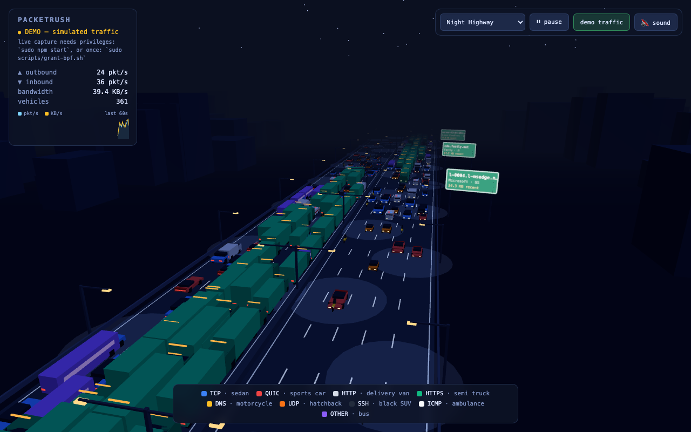](https://flint-knoll-me7j.here.now)

| Protocol | Vehicle |
| --- | --- |
| HTTPS (TCP 443) | semi truck (green container) |
| QUIC (UDP 443) | red sports car |
| HTTP (TCP 80) | delivery van |
| generic TCP | blue sedan |
| DNS (53/5353) | amber motorcycle |
| generic UDP | orange hatchback |
| SSH (TCP 22) | black SUV |
| ICMP (ping) | ambulance |
| everything else | purple bus |

Packet size scales the vehicle. Drag to orbit, scroll to zoom.

Interactions:

- **Click a vehicle** to inspect its packet (hostname/IP, ports, protocol,
  size); click empty road to dismiss.
- **Click a legend chip** to hide that protocol; **alt-click** to show only
  that protocol.
- **Exit signs** on the right shoulder name the top remote destinations
  (offline org/country lookup from `public/geoip.json`); hostnames come from
  server-side cached reverse DNS.
- **HUD sparkline** shows the last 60 s of pkt/s and KB/s.
- **🔇 sound** toggles a procedural engine hum that follows traffic intensity
  (off by default); ambulances (ICMP) blip a tiny siren.
- A connection's packets drive as a **convoy**: same lane, same speed, evenly
  spaced — a download reads as a line of trucks.

## Themes

The surroundings are switchable via the dropdown in the top-right (persisted,
or `/?theme=<key>`): `night` (default), `hawaii` (sunset coast), `autobahn`
(overcast Germany with gantry signs and wind turbines), `bigcity` (neon Vice
City), `ocean` (causeway between nav buoys, cargo ships, lighthouse), `rome`
(Colosseum and umbrella pines), plus movie-inspired scenes: `fury` (desert
mesas), `neon` (cyberpunk rain), `grid` (cyan wireframe world), `snow`
(mountain pass with falling snow), `jungle` (gated tropical island), `mars`
(red planet with habitat domes), `gotham` (gothic towers and a searchlight),
`west` (canyon sunset), `space` (starfield causeway with a ring station), and
`shire` (green hills with round doors). Rain, snow, turbines, searchlight, and
the station ring are animated. All scenes are procedural low-poly geometry —
no external assets.

### Fleets

Some themes swap the cars for a matching fleet — same nine protocol slots, so
the legend, filters, tooltips, and convoys carry over: `ocean` → boats
(container ship, speedboat, ferry, sailboat, jet ski…), `space` → spacecraft,
and ten non-car scenarios: `reef` → fish (Under the Sea), `sky` → aircraft
(Above the Clouds), `rails` → trains (Midnight Express), `savanna` → animals
(Pride Lands), `arctic` → polar animals with an animated aurora (Penguin
March), `dino` → dinosaurs (Valley of Giants), `magic` → dragons, brooms, and
ghosts (Wizard's Night), `christmas` → sleighs and snowmen (Santa's Run),
`depths` → submarines among hydrothermal vents (Silent Depths), and `skyfair`
→ balloons and zeppelins (Up & Away). Boats bob, fliers hover, animals trot.

## Run

```bash
npm install
sudo npm start        # sudo needed for live packet capture on macOS
```

Then open http://localhost:8090.

Without `sudo` the server still runs, but tcpdump can't open the BPF devices,
so the page automatically switches to simulated **demo traffic** (also
toggleable with the button in the top-right, or by opening `/?demo`).

To capture live packets **without sudo**, grant your user BPF access once
(the same `access_bpf` group approach Wireshark uses — creates the group,
adds you, and installs a LaunchDaemon so it survives reboots):

```bash
sudo scripts/grant-bpf.sh     # then open a new terminal and: npm start
sudo scripts/grant-bpf.sh uninstall   # to undo
```

Options:

- `PORT=9000 sudo -E npm start` — change the web port
- `IFACE=en1 sudo -E npm start` — capture a specific interface (default: the
  interface of your default route, usually `en0`)

### Linux

Works the same; the default interface is detected via `ip route show default`.
Live capture needs privileges — either run with `sudo`, or grant tcpdump
capture capabilities once and run unprivileged:

```bash
sudo setcap cap_net_raw,cap_net_admin+eip "$(command -v tcpdump)"
npm start
```

## How it works

- `server.js` spawns `tcpdump -i <iface> -n -q -l -t -U`, parses each line
  (protocol, ports, length), classifies it (port → protocol family), decides
  direction by comparing the source address against the machine's local
  addresses, and streams batches to the browser over WebSocket every 100 ms.
  Packets are tagged with a flow id (normalized 5-tuple; idle flows evicted
  after 30 s) so the client can group a connection's packets into a convoy:
  same lane, same speed, evenly spaced.
- `public/main.js` renders the highway with Three.js. Vehicles are low-poly
  models built from merged colored boxes and drawn with `InstancedMesh` (two
  draw calls per vehicle type), so hundreds of simultaneous vehicles stay
  smooth. Headlights/taillights are unlit geometry so they glow at night.

For a deep dive on architecture, the capture pipeline, flow convoys, the theme
engine, and how to add your own scene or fleet, see **[DOCUMENTATION.md](DOCUMENTATION.md)**.

## Gallery

| | | |
|---|---|---|
| 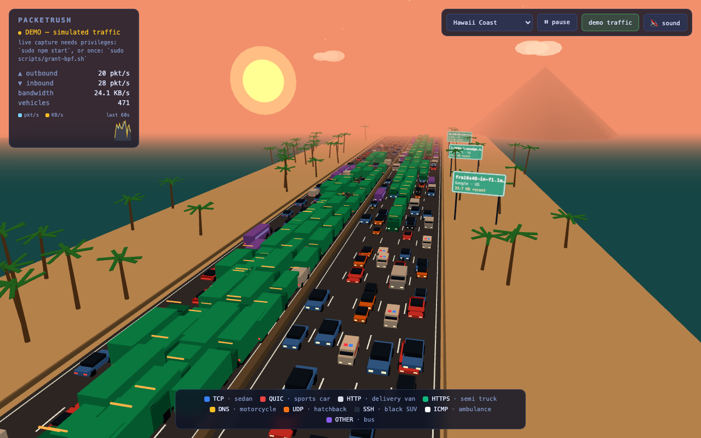 **Hawaii Coast** | 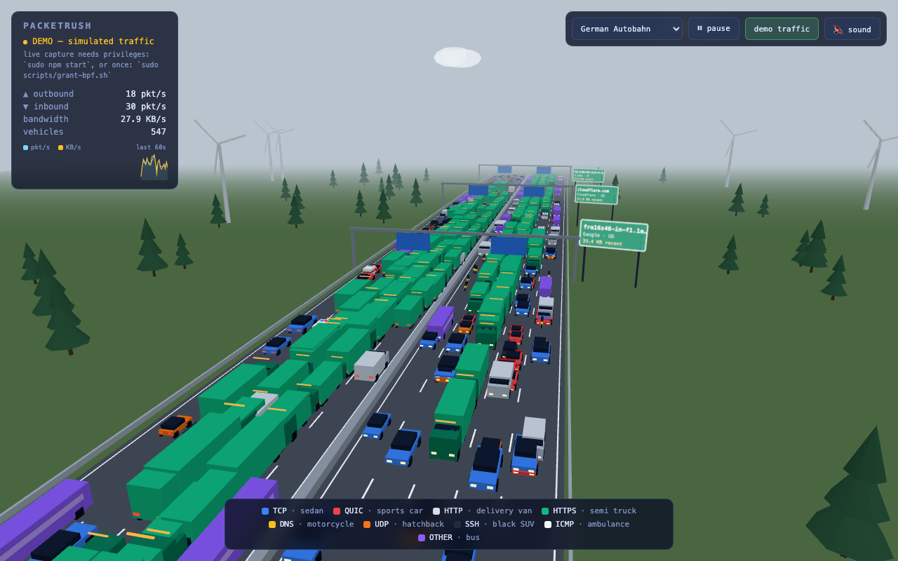 **German Autobahn** | 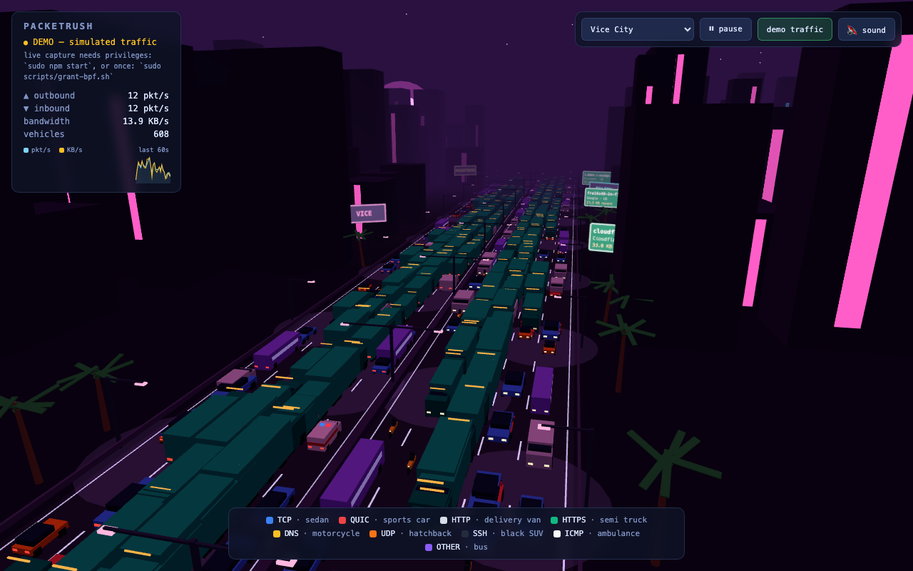 **Vice City** |
| 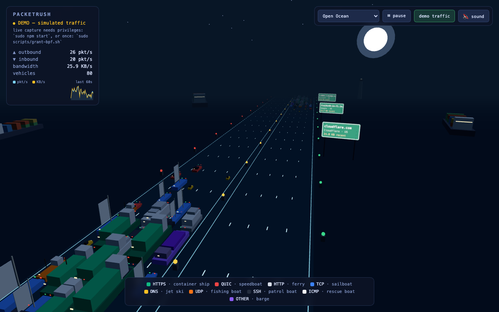 **Open Ocean** (boats) | 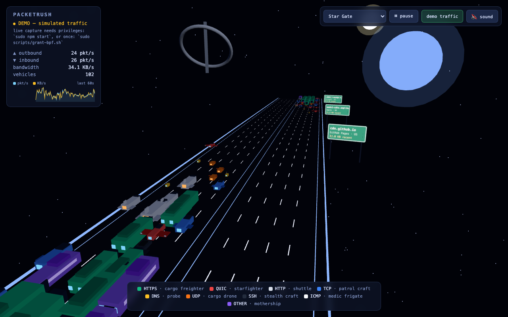 **Star Gate** (spacecraft) | 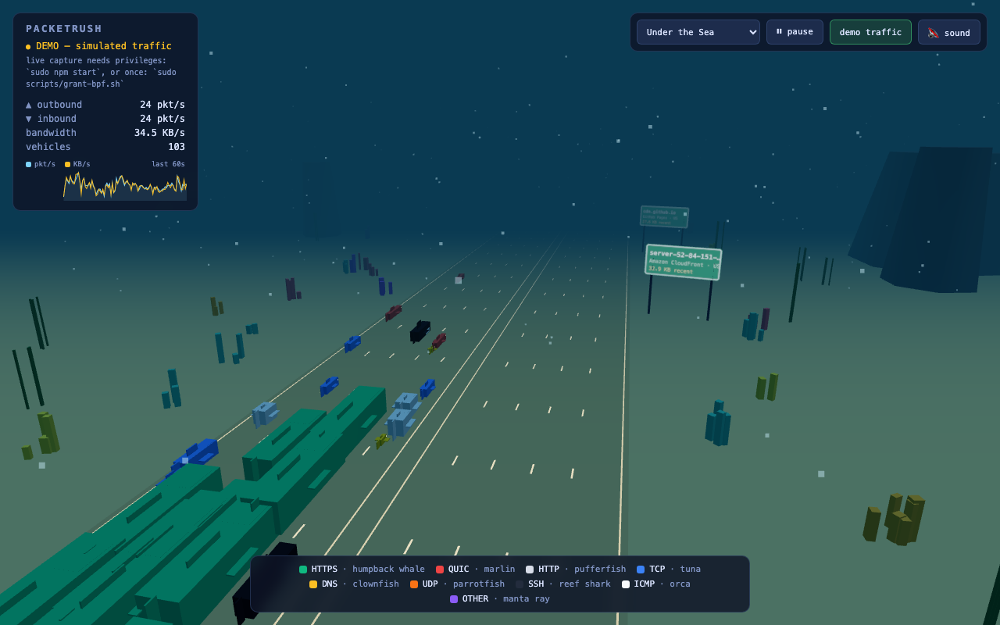 **Under the Sea** (fish) |
| 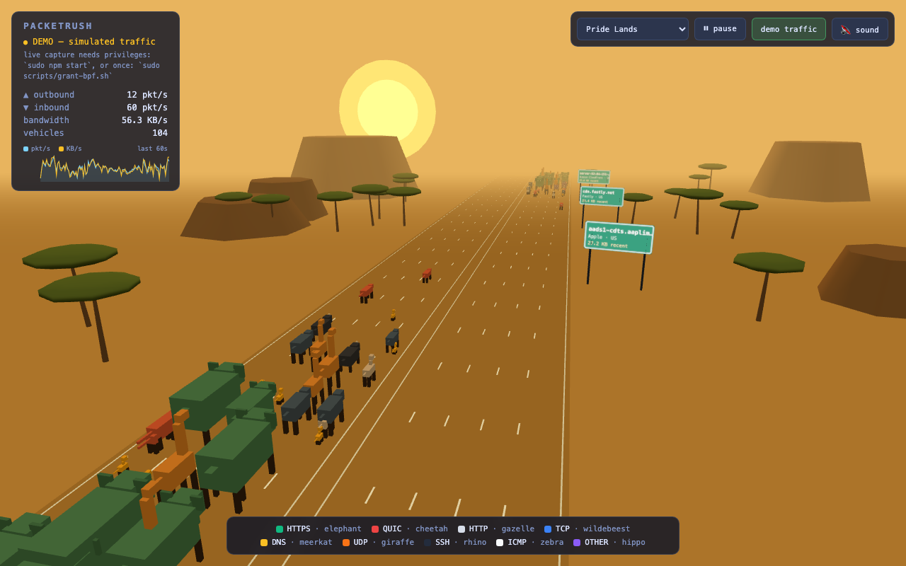 **Pride Lands** (animals) | 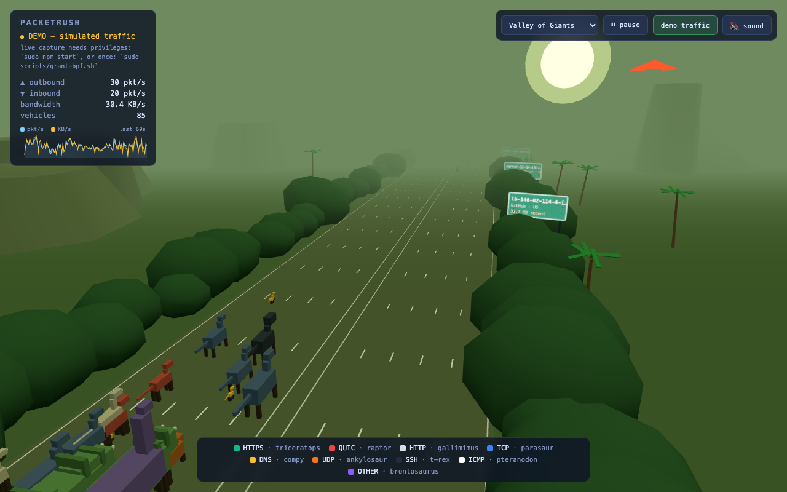 **Valley of Giants** (dinosaurs) | 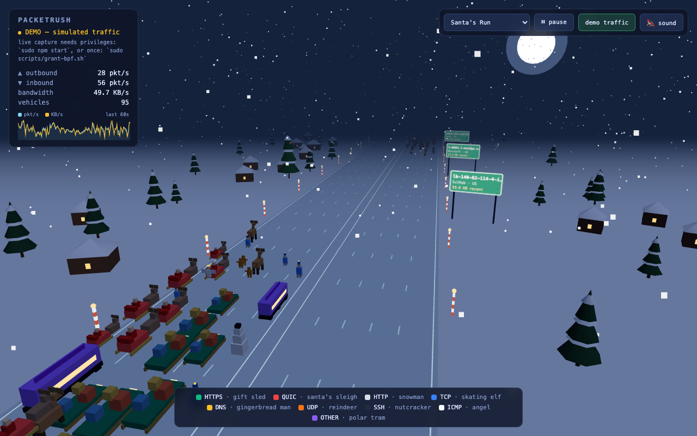 **Santa's Run** |
| 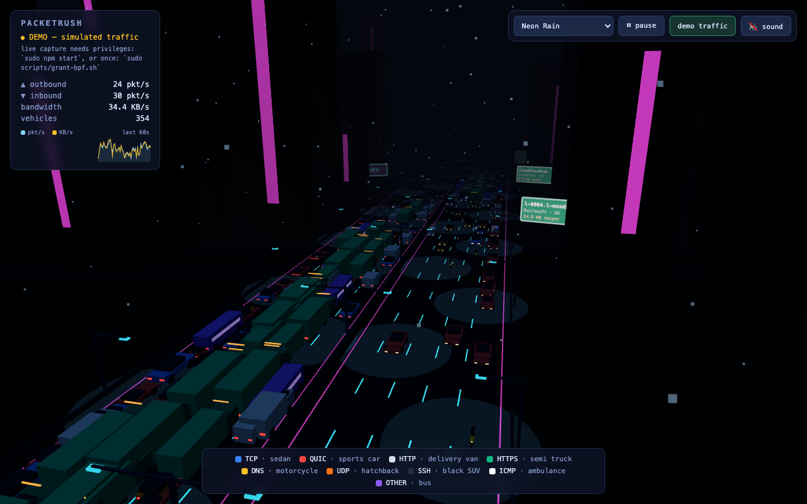 **Neon Rain** | 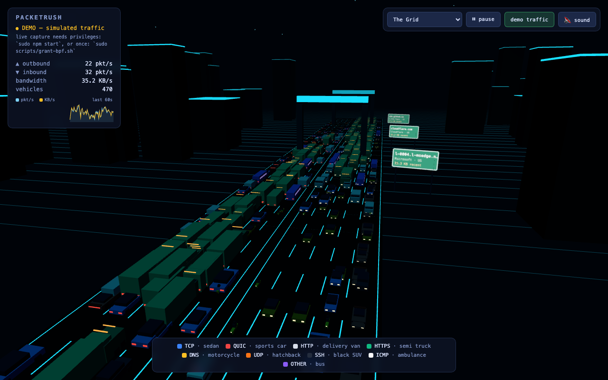 **The Grid** | 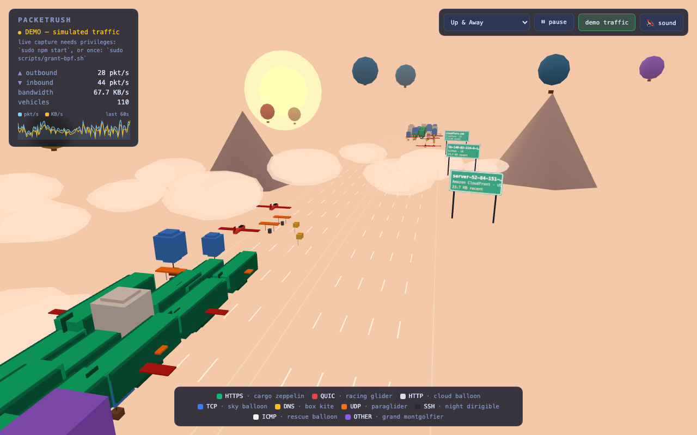 **Up & Away** (balloons) |

All 26 scenes and their fleets are catalogued in [DOCUMENTATION.md](DOCUMENTATION.md#themes--fleets).

## Testing

```bash
npm test     # 31 unit tests (parser, classifier, flow table, reverse DNS)
npm run check # syntax-checks the server and all ES modules
```

The browser-facing features (picking, filters, themes, fleets, sparkline) are
verified with headless Playwright scripts during development.

## Contributing

Issues and pull requests are welcome. Adding a new scene is a ~20-line theme
spec in `public/themes.js`; adding a new fleet is a table of nine vehicle
definitions in `public/fleets.js` — see the
[DOCUMENTATION.md](DOCUMENTATION.md#extending-packetrush) walkthrough.

## License

[MIT](LICENSE) © 2026 Thorsten Meyer.

PacketRush bundles no third-party assets — every vehicle, prop, and scene is
procedural low-poly geometry generated at runtime. Three.js is loaded from a
CDN at the version pinned in `public/index.html`.
